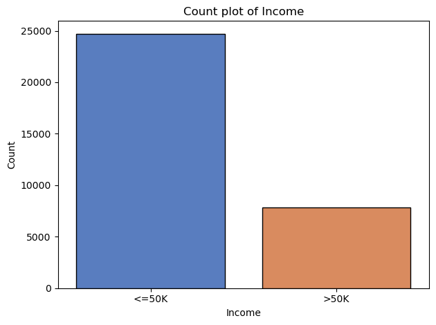
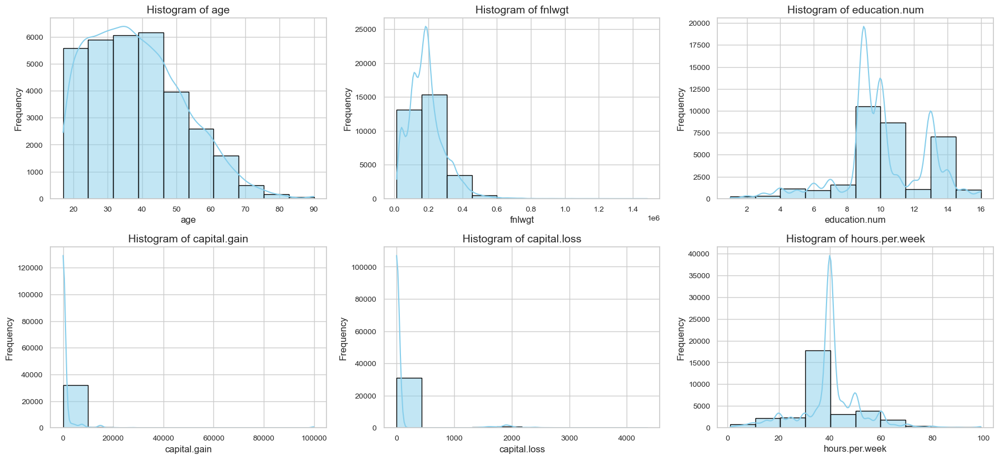

<div align="center">

# 🤖 Adult Income Prediction

[](https://www.python.org/downloads/)
[](LICENSE)
[](https://github.com/psf/black)

[Features](#features) • [Installation](#installation) • [Documentation](#documentation) • [Usage](#usage) • [Contributing](#contributing)

</div>

---

# Executive Summary
This project provides an in-depth exploratory data analysis (EDA) and machine learning modeling for the Adult Income dataset. The objective is to analyze demographic and economic factors influencing income levels and predict whether an individual earns more than $50K per year. Key insights include:

- Education level and occupation significantly impact income levels.
- Individuals in managerial and professional occupations are more likely to earn above $50K.
- Age and capital gain contribute strongly to income prediction.
- Logistic Regression and Decision Tree models perform well for classification.

These findings help in understanding income distribution and improving targeted policy-making and financial planning.

---

# Problem Statement
To analyze and predict whether an individual earns more than $50K annually based on demographic and economic attributes. The analysis aims to:

- Identify key factors influencing income levels.
- Develop predictive models to classify income groups.
- Provide insights into income disparities across different demographic groups.
---

# Dataset
The Adult Income Dataset is a widely used dataset for classification tasks, primarily aimed at predicting whether an individual's income exceeds $50K per year based on various demographic and employment-related attributes. The dataset was originally extracted from the 1994 U.S. Census Bureau database.

### Dataset Link:
```bash
https://www.kaggle.com/datasets/wenruliu/adult-income-dataset
```
### Dataset Details
- **Source**: Kaggle
- **Size**: 48,842 records (32,561 training + 16,281 test)
- **Attributes**: 14 features + 1 target variable
- **Task**: Binary classification (<=50K or >50K income)

### Features:
- **Demographics**: age, sex, race, native-country
- **Education**: education, education-num
- **Employment**: workclass, occupation, hours-per-week
- **Financial**: capital-gain, capital-loss
- **Marital Status & Relationships**: marital-status, relationship
- **Target Variable**: income (<=50K or >50K)
---

# Methodology
### Data Preprocessing
- Handled missing values and removed duplicates.
- Encoded categorical variables using OneHotEncoder and LabelEncoder.
- Standardized numerical features using StandardScaler.

### Tools Used
- **Python Libraries**: Pandas, NumPy, Seaborn, Matplotlib, Scikit-learn, SciPy
- **Machine Learning Models**: Logistic Regression, Decision Tree, Naive Bayes, Support Vector Classifier
---

# Exploratory Data Analysis

#### Count Plot of Target Variable


#### Count Plot of Numerical Variable


# Key Findings
### 1. Demographic Analysis
**Finding**: Education level significantly correlates with income.
**Implication**: Higher education leads to better job opportunities and higher earnings.

### 2. Occupation Trends
**Finding**: People in managerial and professional roles have a higher probability of earning above $50K.
**Implication**: Upskilling and career advancement in these sectors can lead to better financial outcomes.

### 3. Capital Gain & Age Impact
**Finding**: Older individuals with capital gains are more likely to earn above $50K.
**Implication**: Investments and financial planning contribute to income growth over time.

# Model Performance
| Model                 | Accuracy  | Precision | Recall |
|----------------------|-----------|-----------|--------|
| Logistic Regression  | 85.2%     | 0.78      | 0.75   |
| Decision Tree        | 83.5%     | 0.76      | 0.73   |
| Naive Bayes          | 80.1%     | 0.72      | 0.70   |
| SVM                  | 84.0%     | 0.77      | 0.74   |

# Recommendations
- **Education & Training**: Encouraging professional education and skill development can enhance income levels.
- **Job Market Policies**: Government and corporate policies should focus on wage equality and skill-based hiring.
- **Financial Planning**: Capital investment and savings play a crucial role in wealth accumulation.

# Conclusion
This analysis provides key insights into the demographic and economic factors affecting income levels. The findings can be used for financial planning, policy-making, and improving career growth strategies. Future work could explore additional features and more advanced machine learning techniques to improve prediction accuracy.

